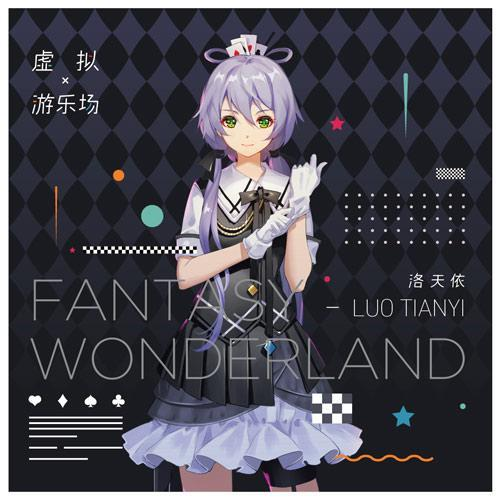
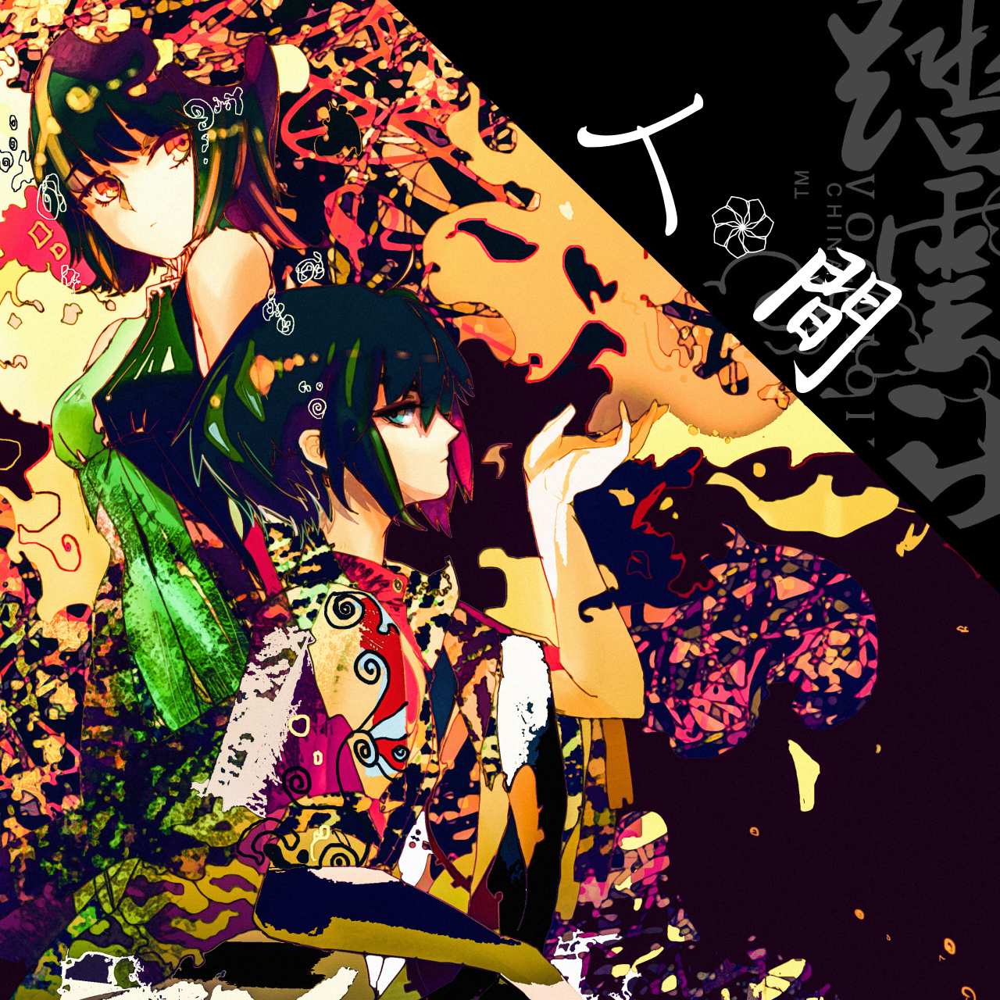
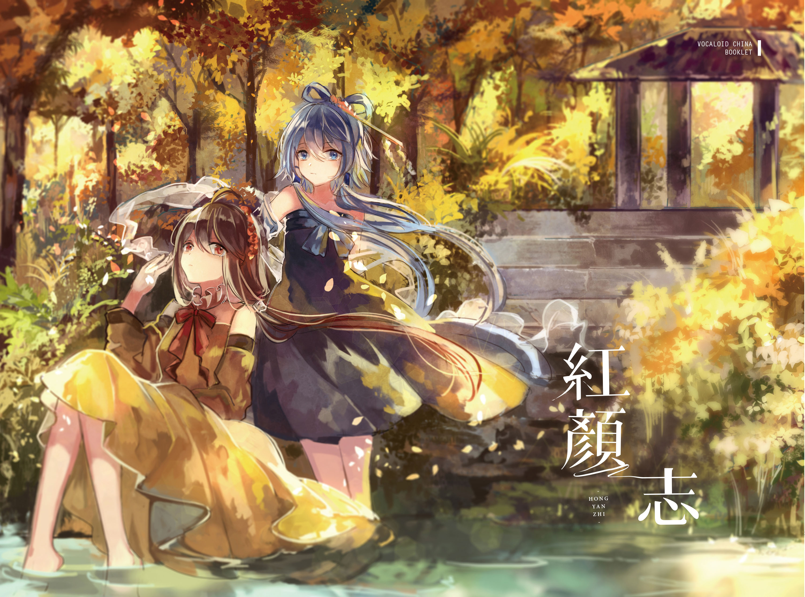
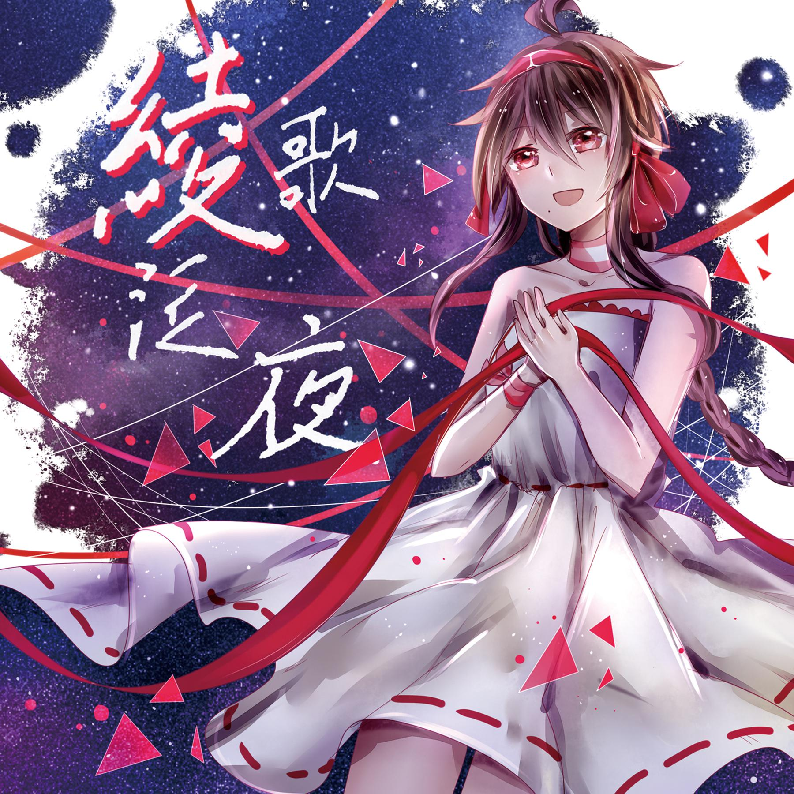

自己整理的 中V & SV 相关专辑列表，绝大部分数据来源于 [VocaDB](https://vocadb.net/)

希望各路大佬能补充和指正

可以交换电子专辑，有红叉的是我没有的

| 专辑图片 | [发行时间] 专辑名称 （歌手） | 有/无 |
| :-: | - | - |
| 官方专辑 | | |
| 禾念 | | |
|  | [120712] Sing Sing Sing （洛天依） | |
|  | [121218] Dance Dance Dance （洛天依） | |
|  | [121224] 梦的七次方 （洛天依） | |
|  | [130323] 星 （洛天依） | |
|  | [130711] The Stage 1 （言和） | |
|  | [131125] The Stage 2 （言和） | |
|  | [170616] 虚拟游乐场 （洛天依;言和） | |
|  | [171202] 绫 （乐正绫） | |
|  | [190301] Lost In Tianyi （洛天依） | |
|  | [200412] 告白诗 （乐正绫） | |
|  | [200520] Side B （墨清弦） | |
|  | [200711] 白日梦 （言和） | |
|  | [200712] Moments （洛天依） | |
| 平行四界 | | |
|  | [140321] 平行四界 （洛天依） | |
|  | [141115] 平行四界 2 （洛天依） | |
|  | [150715] 平行四界 3 （洛天依;乐正绫） | |
|  | [151212] 平行四界 4 （洛天依;乐正绫） | |
|  | [160328] 星愿 （星尘） | |
|  | [160715] 平行四界 5 （洛天依;乐正绫;星尘） | |
|  | [160724] 平行四界×轻文轻小说 EP Vol. 1 （星尘） | |
|  | [161130] 南北极星 Vol.1 （洛天依;乐正绫;星尘） | |
|  | [170228] 星语 （星尘） | |
|  | [170915] 平行四界Live Tour （星尘） | |
|  | [180323] 平行四界 6 （洛天依;乐正绫;星尘;言和;初音ミク） | |
|  | [180511] 星之海 （星尘;海伊） | |
|  | [181031] 亚特兰蒂斯 （海伊） | |
|  | [190331] 天方夜谭 （星尘;海伊;苍穹） | |
|  | [190706] 天马行空 （星尘;赤羽;诗岸） | |
|  | [190812] 星尘官方CG作品集 Vol. 1 （星尘） | ❌ |
|  | [191006] 森罗万象 （星尘;赤羽;海伊） | |
|  | [200228] 丛林法则 （星尘;苍穹;诗岸） | |
|  | [200612] 吉光片羽 （星尘;苍穹;赤羽） | ❌ |
| 望乘 | | |
|  | [160204] 心華 （心华） | |
|  | [170708] 华彩 （心华） | |
|  | [180125] 心花四季 （心华） | |
| VOICEMITH | | |
|  | [180616] LISTEN （夏语遥） | |
| 新创华 | | |
|  | [200313] 缤纷世界 （初音ミク） | |
| 社团、团队 | | |
| Days乐团 | | |
|  | [120213] 失落的机械城：边境小镇物语 （初音ミク;鏡音レン;Kaede;Luna;西国の海妖） | |
|  | [120721] Summer Days （洛天依） | |
|  | [121214] 三月雨 （洛天依） | |
|  | [130731] 忆香 （洛天依;言和） | |
|  | [140430] 失落的机械城Ⅱ：虚浮之都 （初音ミク;泠鸢yousa;洛天依;祈Inory;山新） | |
|  | [150930] Travel Days （不才;景三;乐正绫;泠鸢yousa;洛天依;祈Inory;心华;羊田;佑可猫） | ❌ |
| 咏吟轩 | | |
|  | [130511] 第一步 （洛天依） | |
|  | [140712] 第二页 （洛天依;言和） | |
|  | [150606] 行星infinity （洛天依;言和;GUMI） | |
|  | [160615] Play！Play！ （洛天依;言和;GUMI;鏡音レン） | |
|  | [171209] 深渊异歌 （洛天依;言和;乐正龙牙） | |
| Aerial Audio System | | |
|  | [130611] 电音斗剧 vol.1 （蒼姫ラピス;洛天依） | |
|  | [150606] 电音斗剧 2 Daybreak （蒼姫ラピス;洛天依） | |
| 龙皇社 | | |
|  | [130830] 月思 （洛天依） | |
| 殿堂团队 | | |
|  | [140205] 殿堂1 （洛天依;言和） | |
|  | [151025] 殿堂2 （洛天依;言和;心华） | |
|  | [160619] 朝花夕拾 （洛天依;言和;乐正绫;星尘;心华） | |
|  | [170212] 殿堂3 （洛天依;言和;乐正绫;心华;GUMI） | |
|  | [180519] 朝花夕拾2 （洛天依;言和;乐正绫） | |
|  | [181214] 朝花夕拾3 （洛天依;言和;乐正绫;星尘;心华） | |
|  | [190607] 唯声 （洛天依;言和;乐正绫;星尘;心华） | |
| 无名社 | | |
|  | [170501] 无名 （洛天依;言和;乐正绫;星尘;心华） | |
|  | [190913] 名字 （洛天依;言和;乐正绫;星尘;起复;起礼） | |
| 黑Nya社 | | |
|  | [170707] Ling听 （乐正绫） | |
|  | [190504] 唯Yi （洛天依） | |
| 踏云社 | | |
|  | [170820] 人·間 （洛天依;言和;乐正绫;星尘;心华） | |
|  | [190608] 恶之花 （洛天依;言和;乐正绫;星尘;心华;乐正龙牙;墨清弦;徵羽摩柯） | |
| Mikai Music | | |
|  | [171108] 初梦 （初音ミク） | |
|  | [180116] 初梦 Deluxe （初音ミク） | |
|  | [190715] 恋糖 （初音ミク） | |
| AnoProject | | |
|  | [181117] 秘密邮件 （galaco;IA;MAYU;初音ミク;結月ゆかり;乐正绫;洛天依;心华;言和） | |
|  | [200617] 琉璃色前奏曲 （洛天依） | ❌ |
| BE pharma. | | |
|  | [181208] 声迹 BEsappear （初音ミク;夏语遥;心华） | ❌ |
| 糖果工坊 | | |
|  | [191116] 维·爱L'amouЯ （苍穹;赤羽;海伊;诗岸;星尘） | |
|  | [200708] FIND ZERO （苍穹;赤羽;赤塚優一;初音ミク;海伊;星尘） | ❌ |
| 奶牛组 | | |
|  | [191221] 止谎剂 （苍穹;诗岸;星尘） | |
|  | [191221] 深潜之宙 （苍穹） | |
| 个人专辑 | | |
| 裕剑流 | | |
|  | [130526] 重力幻想曲 （GUMI;初音ミク;鏡音リン;鏡音レン;洛天依;阮小七） | |
|  | [131123] 354机甲少女骑士团 （GUMI;IA;KAITO;初音ミク;鏡音リン;鏡音レン;洛天依;言和） | |
|  | [140510] 放学后的文学部 （GUMI;IA;KAITO;初音ミク;鏡音リン;鏡音レン;洛天依;言和） | |
|  | [200501] 飞行梦 （乐正绫;洛天依;神威がくぽ;萧桦坚;言和） | |
| DELA & 雨狸 | | |
|  | [140802] Saligia·孤独的七种形态 （洛天依;言和） | |
|  | [160915] Dear: （乐正绫;洛天依;星尘;言和） | |
|  | [170317] 妄想症Paranoia （乐正绫;洛天依;言和） | |
| TUNO桐音 | | |
|  | [150816] 南北寻光 （乐正绫;洛天依） | ❌ |
|  | [170320] 南北寻光（最终版） （乐正绫;洛天依） | |
| JUSF周存 | | |
|  | [150918] 双向·轮回与幸福 （乐正绫;洛天依;言和） | |
|  | [180201] Godrose （乐正绫;乐正龙牙;洛天依;言和;鏡音レン） | |
|  | [180201] 火葬 （鏡音レン） | |
| iKz_茶壶 | | |
|  | [160609] 幻想·幻境 （乐正绫;祖娅纳惜） | ❌ |
| 阿良良木健 | | |
|  | [160809] 恋爱理论 （洛天依;乐正绫） | |
|  | [181116] 奇爱人生 （洛天依;乐正绫;乐正龙牙;墨清弦;言和;徵羽摩柯） | |
|  纯白 | | |
|  | [160815] 中华少女Project （乐正绫;洛天依;心华;星尘） | |
|  | [180519] 心弦 （心华） | |
| 阿原Adam | | |
|  | [161002] 红颜志 （洛天依;乐正绫） | |
|  | [181029] 如是我闻 （洛天依;言和;乐正绫;星尘;心华;乐正龙牙;墨清弦;徵羽摩柯） | |
| PoKeR | | |
|  | [161203] 秒 （洛天依） | |
| 小野道ono | | |
|  | [170430] 蝴蝶旅客 （星尘） | |
|  | [181111] 泡沫 （初音ミク） | |
| 砖厂浪人 | | |
|  | [170607] 四季四世 （乐正绫;洛天依;星尘;言和） | |
| Zeno | | |
|  | [171030] Freesia （星尘） | |
| Sya | | |
|  | [171209] Kill My （洛天依;言和） | |
|  | [190329] 肆自 （洛天依） | |
| 枭目☆moku | | |
|  | [180320] 卡纳塔幻想曲 （乐正绫;乐正龙牙;洛天依;星尘;言和） | |
|  | [190518] 諾 （言和） | |
| ACK★ | | |
|  | [180804] 骤雨初歇 （洛天依;星尘;言和） | |
|  | [190803] 所能看见的我的全部 （IA;Mac音ナナ;初音ミク;洛天依;言和） | ❌ |
| Fizer0046 | | |
|  | [181110] 雨中巴士站 （星尘） | |
|  | [200301] 塌陷于38°C的蓝 （海伊;诗岸;星尘） | |
|  | [200727] 月光入侵计划 （诗岸） | |
| 米库喵 | | |
|  | [181117] STILL WITH U （初音ミク） | ❌ |
| 味素 | | |
|  | [181215] SPICE （初音ミク） | |
| 绛舞乱丸 | | |
|  | [190329] 从众效应 （乐正绫;乐正龙牙;洛天依;墨清弦） | |
| ilem | | |
|  | [190919] 2:3 （洛天依;言和;乐正龙牙） | |
| Yaume 缘梦心音P | | |
|  | [191005] 无色圣界 （初音ミク） | |
| Nekock·LK | | |
|  | [191221] 暗适应ЯEMOTION （初音ミク） | |
| 康师傅の海鲜面 | | |
|  | [200424] 甘泽谣 （乐正绫;乐正龙牙;洛天依;墨清弦;星尘;言和） | |
| 夜屠灵 | | |
|  | [200520] 海盼伊人 （海伊） | |
| 其他专辑 | | |
|  | [121222] Miles;Smile （サクヤ;初音ミク;泠鸢yousa;洛天依;鸦糜;杨云翔） | ❌ |
|  | [130320] 丝染苍黄 （洛天依） | |
|  | [131020] 花洛兮 （洛天依） | ❌ |
|  | [131122] 感谢 （洛天依） | ❌ |
|  | [140304] X-Loid （初音ミク;洛天依） | |
|  | [140518] Vocaloeater （洛天依;言和） | ❌ |
|  | [140601] Distortion and Overdrive （GUMI;洛天依;佑可猫;水曜日） | ❌ |
|  | [140825] 芳菲九陌 （洛天依） | ❌ |
|  | [140901] 月行书 （洛天依;言和） | ❌ |
|  | [150901] 红-花开时代 （洛天依） | |
|  | [160618] 只是孩子 （洛天依;言和） | ❌ |
|  | [161202] ·星·间物语 （初音ミク;洛天依;kokone） | |
|  | [170223] 起点 （鏡音リン;洛天依） | |
|  | [170315] 节气物语(春夏卷) （乐正绫;洛天依） | |
|  | [170818] 绫歌泛夜 （乐正绫） | |
|  | [180210] I （初音ミク） | |
|  | [180516] 华哉有夏 （乐正绫;乐正龙牙;洛天依;言和） | |
|  | [180706] ∞ （洛天依） | |
|  | [180711] 预定调和 （言和） | |
|  | [180731] 天宫九问 （洛天依;乐正绫） | |
|  | [180907] No.13852 （洛天依;言和;心华） | |
|  | [181001] 星临 （星砂;星尘;洛亦天;言和;乐正龙牙） | |
|  | [181011] 未来之旅 （初音ミク） | |
|  | [181102] 人造树的幽灵 （徵羽摩柯） | ❌ |
|  | [190209] 末日－ENDLESS－ （星尘;心华;初音ミク;薛南;kier;いくせん） | ❌ |
|  | [190731] THE GALLERY （星尘;赤羽） | ❌ |
|  | [191210] 柒 （洛天依;乐正绫;言和） | |
|  | [200320] Cotton Candy （音街ウナ;星尘;洛天依;乐正绫） | |
|  | [200330] FM40.4 （星尘） | |
|  | [200401] NoISE/心噪音 （Lucifer X;赤羽;海伊;乐正绫;洛天依;南宮彰;星尘;言和） | |
|  | [200604] 淡漠 （赤羽;诗岸;Eleanor Forte） | ❌ |